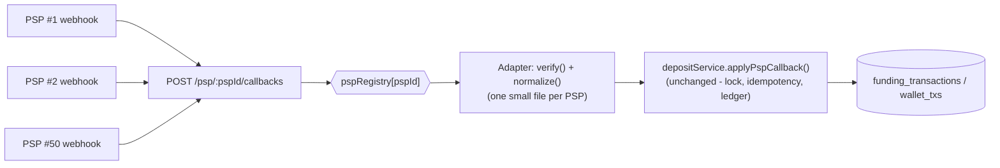

# Design note: the 50th PSP

**Question:** how should the codebase be structured so that integrating a new PSP is a one-day task, safe for a junior engineer to do alone?

## Today's problem

`POST /psp/callbacks` (in `src/routes/pspCallbacks.ts`) hard-codes the mock PSP's shape: it assumes the body already looks like `{ pspRef, status: 'completed'|'failed', amount }`. All the hard, risky logic — locking `funding_transactions` by `psp_ref`, the idempotency guard, crediting the ledger, updating the balance — lives in `depositService.applyPspCallback()` and is already correct and tested. That function must never change when a new PSP is added; only the translation from "whatever that PSP sends" into that one canonical shape should change.

## The abstraction: `PspAdapter`

```ts
interface PspAdapter {
  id: string; // e.g. 'mock', 'stripe-like', 'momo'
  verify(rawBody: unknown, headers: Record<string, string>): boolean;
  normalize(rawBody: unknown): { pspRef: string; status: 'completed' | 'failed'; amount: string };
}
```

Every PSP gets its own file (`src/psp/adapters/<name>.ts`) implementing this. `verify` checks that PSP's specific signature scheme (HMAC header, shared secret, IP allowlist, whatever it uses); `normalize` maps its field names, status vocabulary, and amount unit (some PSPs send minor units, e.g. cents) into the shape `applyPspCallback` already accepts. A junior engineer's whole job for a new PSP is writing these two functions against that PSP's docs — no locking, no transactions, no ledger code to touch or understand.

## Where verification and normalization live

Both live **inside the adapter**, not in the route and not in `depositService`. The route becomes PSP-agnostic:

```ts
// src/routes/pspCallbacks.ts
pspCallbacksRouter.post('/:pspId', async (req, res, next) => {
  try {
    const adapter = pspRegistry[req.params.pspId];
    if (!adapter) throw new HttpError(404, { error: 'unknown_psp' });
    if (!adapter.verify(req.body, req.headers as Record<string, string>)) {
      throw new HttpError(401, { error: 'invalid_signature' });
    }
    const { pspRef, status, amount } = adapter.normalize(req.body);
    await depositService.applyPspCallback(pspRef, status, amount);
    res.status(200).json({ status: 'ok' });
  } catch (err) {
    next(err);
  }
});
```

`depositService.applyPspCallback` is called with the exact same three arguments regardless of which PSP called — it has no idea a 50th PSP exists.

## Config-driven

`src/psp/registry.ts` is a plain `Record<string, PspAdapter>` built at startup from the adapter modules; adding a PSP means adding one entry here plus one adapter file — no route or service change. Each adapter reads its own secrets/settings from `src/config.ts` (extended with a `psp` section, populated from env vars), exactly like `config.databaseUrl` already works. Nothing PSP-specific is hard-coded in an adapter file except field-mapping logic; credentials and endpoints are all config, so staging vs. production is just different env vars.

## Testing without a reliably callable provider in CI

Two layers, neither calls the real PSP:

1. **Fixtures.** For each PSP, check in a handful of real (or sandbox-doc) sample payloads as JSON — a success, a failure, and a tampered/invalid-signature one. A test feeds each fixture straight into that adapter's `verify()`/`normalize()` and asserts the output. This is what catches "PSP changed a field name" or "amount is actually in cents, not dollars" before it hits production.
2. **A shared contract test.** One test suite (`pspAdapterContract(adapter, fixtures)`) run against every adapter, asserting the interface's invariants hold for all of them: `normalize()` always returns a valid decimal string for `amount`, `status` is always exactly `'completed'` or `'failed'`, `verify()` rejects a payload with a mutated signature. This is what stops a new adapter from silently breaking the contract the rest of the system depends on.

A manual smoke test against the PSP's real sandbox (run by hand, not in CI) is the only place an actual network call happens, and it's optional — the fixture + contract tests are enough to merge safely.

## Sketch


