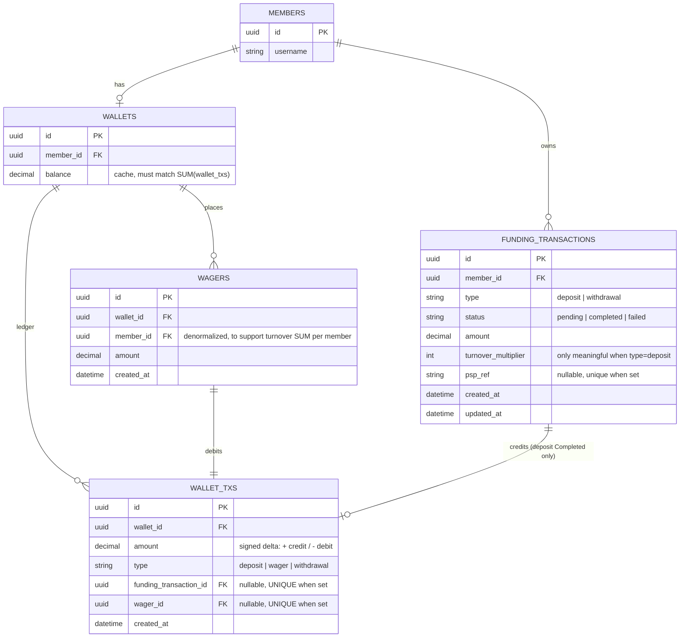
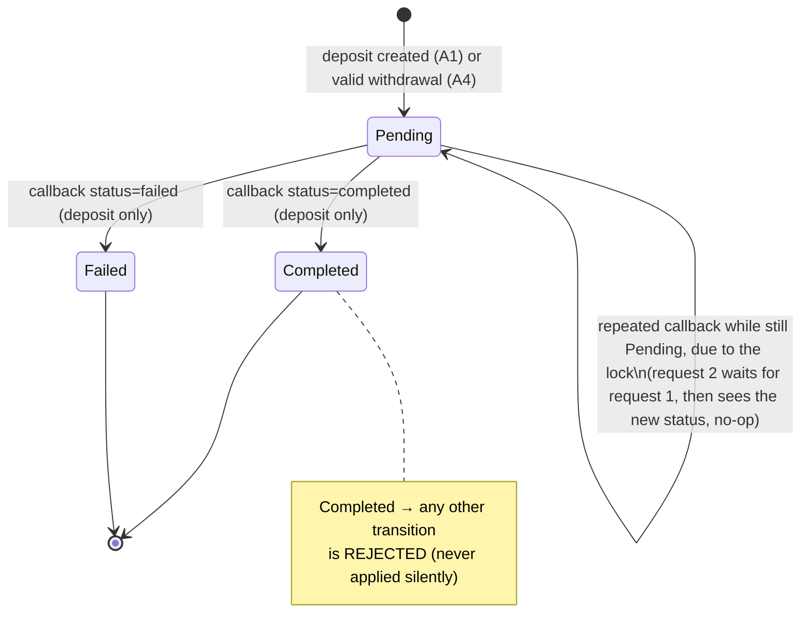
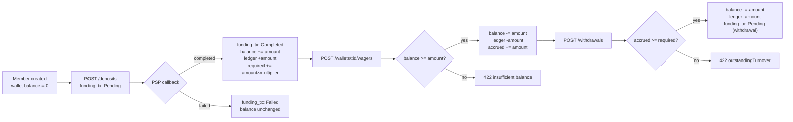

# Architecture & Schema

> Content **shared across every feature** (schema, state machine, overall workflow, API contract) — not specific to any one of A1-A4, so it doesn't belong in a single `<feature>-plan.md`. Per-feature design lives in `create-deposit-plan.md`, `psp-callback-plan.md`, `wager-plan.md`, `withdrawal-plan.md` (same level in `docs/`); the real code lives in the matching `*-code-plan.md` files. Source: `TASK.md`, `../schema.dbml`.

## Schema — changes from the original `schema.dbml`

A few gaps/inconsistencies were fixed to match the requirements:

- **`transaction` → renamed to `funding_transactions`**, shared by both deposit and withdrawal (the assignment calls both a "funding transaction", with the same `Pending → Completed/Failed` state machine):
  - Added `type` (`deposit | withdrawal`) — missing in the original, so the two couldn't be distinguished.
  - Added `amount` — **entirely missing** in the original, required to know how much to credit/debit.
  - Added `turnover_multiplier` — missing, needed for A4.
  - `psp_ref`: nullable (withdrawals don't have one), but **unique when set** — this is the key guard for idempotency in A2.
  - Added `updated_at`.
- **`waller_txs` → renamed to `wallet_txs`** (fixed the typo), and changed the meaning of its columns:
  - The original `balance` column was ambiguous (post-transaction balance, or the amount changed?). Changed to **`amount` = a signed delta** (positive = credit, negative = debit) to match "ledger" semantics, satisfying the *"wallet balance must always be reconstructible from the ledger"* requirement via `SUM(amount) WHERE wallet_id = ?`.
  - `transactionType` (`DESPOIT/WITHDRAW`, with a typo) → renamed to `type` (`deposit | wager | withdrawal`) — **added `wager`**, since wagers must write a ledger entry too (missing in the original).
  - Added `funding_transaction_id` (nullable) and `wager_id` (nullable) — pointing back to the originating transaction, exactly one of the two must be set.
  - **Unique index on `funding_transaction_id` (when not NULL)** — the core mechanism guaranteeing *"credit exactly once"*: if the logic had a bug and tried to insert a ledger row twice for the same funding transaction, the database blocks it with a unique violation (defense in depth, see `psp-callback-plan.md`).
- **`wager` → renamed to `wagers`**, dropped the `status` column (see `wager-plan.md`), added `wallet_id` (the route is `/wallets/:walletId/wagers`, missing in the original — it only had `memberId`).
- **Dropped the `turnover` table entirely** (computed on the fly instead — see `withdrawal-plan.md`).
- `datetimeoffset` isn't a valid Postgres type (that's SQL Server syntax) → used `Sequelize.DATE` (maps to `timestamptz`) like the existing migrations (`created_at`/`updated_at`) already do.

### ERD

## Locking strategy — general principle

Every operation that changes a balance runs inside one DB transaction and locks exactly one row with `SELECT ... FOR UPDATE` before reading/writing, following the pattern already in `memberService.createMember`. The step-by-step detail per feature (which row is locked, in what order) lives in each `<feature>-plan.md`: `psp-callback-plan.md`, `wager-plan.md`, `withdrawal-plan.md`.

## State machine — `funding_transactions.status`

> Shared by A1 (creates Pending), A2 (Pending → Completed/Failed via callback), A4 (creates Pending on a valid withdrawal).

## Overall workflow (one member's lifecycle)

## API contract summary

| Endpoint | Body | Success | Business error | Plan |
|---|---|---|---|---|
| `POST /deposits` | `{memberId, amount, turnoverMultiplier?}` | `201 {id, pspRef}` | `400` zod validation, `404` member | `create-deposit-plan.md` |
| `POST /psp/callbacks` | `{pspRef, status, amount}` | `200` (including an idempotent no-op) | `404` if `pspRef` doesn't exist | `psp-callback-plan.md` |
| `POST /wallets/:walletId/wagers` | `{amount}` | `201 {id}` | `422` insufficient balance | `wager-plan.md` |
| `POST /withdrawals` | `{memberId, amount}` | `201 {id, status: Pending}` | `422 {outstandingTurnover}` | `withdrawal-plan.md` |

## Test plan overview (maps to A5)

Detailed test cases per feature live in the matching `*-code-plan.md`. Overview:

| Test | Scenario | Guaranteed by |
|---|---|---|
| Sequential duplicate callback | Call the callback twice in a row, same `pspRef` | status guard, `psp-callback-plan.md` |
| Concurrent duplicate callback | `Promise.all([callback(), callback()])`, same `pspRef` | `SELECT ... FOR UPDATE`, `psp-callback-plan.md` |
| Concurrent wagers don't overdraw | `Promise.all([wager(10), wager(10)])` on a wallet with 15 | `SELECT wallet FOR UPDATE`, `wager-plan.md` |
| Turnover blocks/unblocks correctly | Withdraw while under turnover → `422`; enough wagers → withdrawal succeeds | `SUM` required vs accrued, `withdrawal-plan.md` |
| (bonus) Ledger reconstruction | After a sequence of transactions, `SUM(wallet_txs.amount) == wallets.balance` | Checks the system invariant |

## Proposed implementation order

1. Migrations: `create-funding-transactions`, `create-wagers`, `create-wallet-txs` (this order because `wallet_txs` FKs to both of the other two tables).
2. Matching Sequelize models, registered in `db/models/index.ts` + associations.
3. `src/lib/pspRef.ts` — the `pspRef` generator function.
4. For each feature A1-A4: write `<feature>-plan.md` (design) → review → write `<feature>-code-plan.md` (real code) → review → create the code files in `src/` → write tests.
5. Update `DECISIONS.md` continuously while coding, not all at the end.
6. `DESIGN-PSP.md` (Part B) once Part A is done.
