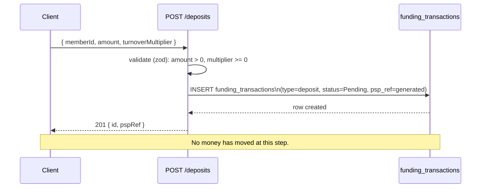

# Plan — A1: Create Deposit (`POST /deposits`)

> Design written before coding. Real code lives in `create-deposit-code-plan.md`. Shared schema/ERD/state machine: see `architecture.md`.

## Requirement (summarized from `TASK.md`)

`POST /deposits` takes `{ memberId, amount, turnoverMultiplier }`, creates a funding transaction in `Pending` state, returns `201` with the id and a generated `pspRef`. **No money moves at this step.** `amount` is a decimal string and must be positive; `turnoverMultiplier` is an integer ≥ 0, default `1`.

## Sequence diagram

## Related decisions

- No `sequelize.transaction` wrapper — only 1 row is written (`funding_transactions`), consistent with the "transaction only required when writing >1 row" convention.
- `memberId` must exist (checked via `Member.findByPk` first) — returns a clean `404` instead of letting an FK constraint error surface as `500`.
- No locking needed in A1 — there's no concurrent contention on any single resource (each request creates a new, independent row).
