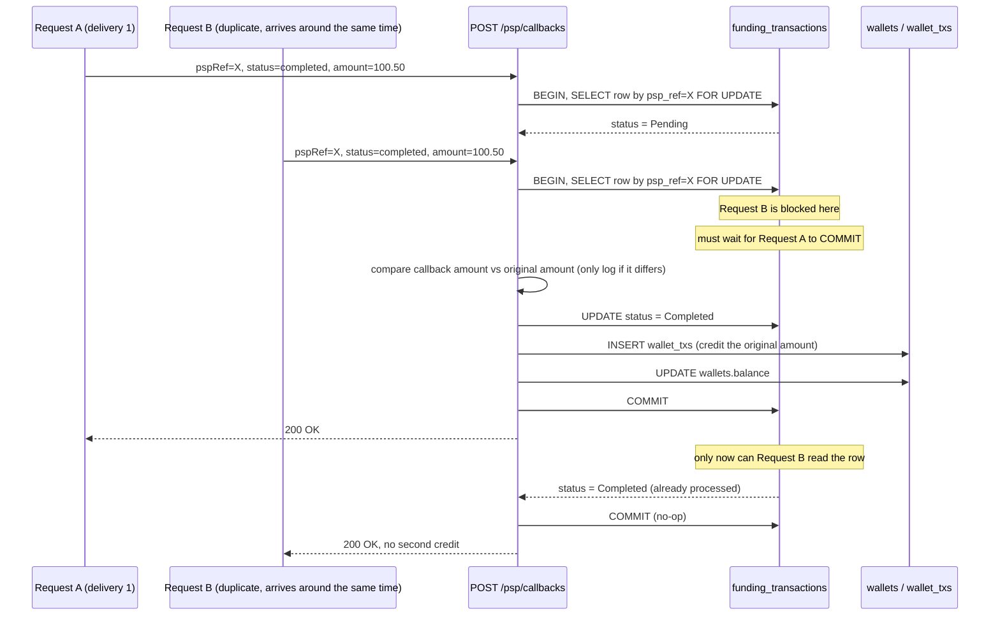

# Plan — A2: PSP Callback (`POST /psp/callbacks`)

> The core of the assignment. Design written before coding. Real code lives in `psp-callback-code-plan.md`. Shared state machine: see `architecture.md`.

## Requirement (summarized from `TASK.md`)

`POST /psp/callbacks` takes `{ pspRef, status, amount }` (`status` is `completed | failed`). This is the webhook the mock PSP calls when a payment finishes. Must assume: the callback can arrive **more than once** (delayed by hours), **two deliveries can arrive at the same instant**, `amount` may differ from the deposit's, `pspRef` may be unknown. Hard requirements: credit exactly **once** no matter how many times/how concurrently it's called, write an append-only ledger entry, and a `Pending → Completed/Failed` state machine that rejects invalid transitions.

## Related decisions

| Topic | Decision | Why |
|---|---|---|
| Amount mismatch in the callback | **Trust the original `amount` recorded at deposit time.** The callback's `amount` is only used for reconciliation/a warning log if it disagrees, never for crediting. | The PSP is "hostile infrastructure" (per the assignment) — don't let an external source decide how much to credit into a wallet — avoids bugs/abuse via a fake amount or a formatting error (minor units...). Detail: `../DECISIONS.md` #5. |

## Locking & idempotency strategy (step by step)

1. `BEGIN`
2. `SELECT * FROM funding_transactions WHERE psp_ref = :ref FOR UPDATE` — if not found → a clear error (`404 unknown_psp_ref`), not a thrown `500`.
3. If `status != Pending` → **no-op, always return `200`** (already processed — this is the idempotency point). A later request (whether sequential or arriving while the first is mid-flight) is safe either way: `FOR UPDATE` forces the second request to **wait** until the first commits before it can read `status`, at which point it sees `Completed`/`Failed` and stops.
4. If `status == Pending`: update `status` per `callback.status` (`completed`→`Completed`, `failed`→`Failed`); if `completed`: also lock the `wallets` row (`FOR UPDATE`), insert `wallet_txs` (`amount = +funding_transactions.amount`, not the callback's amount), `UPDATE wallets SET balance = balance + amount`.
5. `COMMIT`.

Second line of defense: a unique index on `wallet_txs.funding_transaction_id` — even if step 3 had a bug, a duplicate ledger insert would still be rejected by the database as a unique violation. Detail: `../DECISIONS.md` #2.

## Sequence diagram (duplicate + concurrent)

