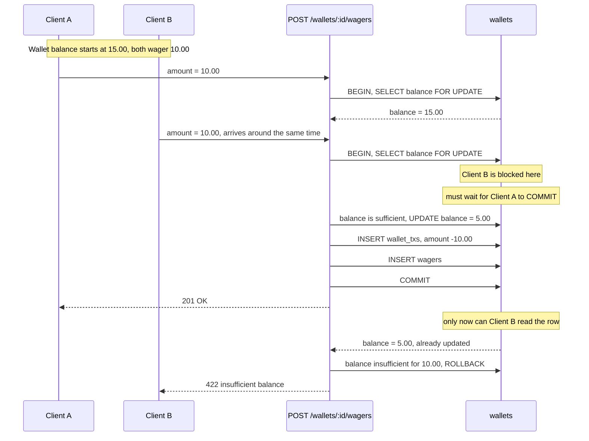

# Plan — A3: Wager (`POST /wallets/:walletId/wagers`)

> Design written before coding. Not implemented yet — `wager-code-plan.md` will be written before creating the code files, pending review. Shared schema/ERD/state machine: see `architecture.md`.

## Requirement (summarized from `TASK.md`)

`POST /wallets/:walletId/wagers` takes `{ amount }`. Debits the wallet (reject if insufficient balance), accrues turnover (used in A4). Must write a ledger entry, same concurrency requirement as A2: **two concurrent wagers must not overdraw the wallet**.

## Related decisions

| Topic | Decision | Why |
|---|---|---|
| Wager state | **No Pending/Completed/Failed state.** A request is a synchronous debit inside one DB transaction: sufficient funds → debit immediately + write the ledger; insufficient → reject, no record created. | There's no async step for a wager (unlike deposit/withdrawal, which wait on the PSP/a human). Detail: `../DECISIONS.md` #7. |

## Locking strategy (step by step)

1. `BEGIN`
2. `SELECT * FROM wallets WHERE id = :walletId FOR UPDATE` — a second request must wait for the first to finish before it can read the latest balance.
3. If `balance < amount` → rollback, return `422`.
4. Otherwise: `UPDATE wallets SET balance = balance - amount`, insert `wallet_txs` (negative amount, `wager_id` pointing to the wager about to be created), insert `wagers`.
5. `COMMIT`.

## Sequence diagram (concurrent wagers, overdraw protection)

