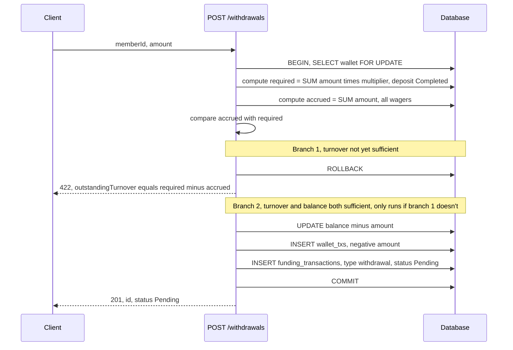

# Plan — A4: Withdrawal + turnover lock (`POST /withdrawals`)

> Design written before coding. Not implemented yet — `withdrawal-code-plan.md` will be written before creating the code files, pending review. Shared schema/ERD/state machine: see `architecture.md`.

## Requirement (summarized from `TASK.md`)

`POST /withdrawals` takes `{ memberId, amount }`. Every completed deposit adds a turnover requirement of `amount × turnoverMultiplier`. Every wager adds to accrued turnover = the wager's amount. A member may withdraw only when accrued turnover ≥ total required turnover, otherwise return `422` with the outstanding amount. A valid withdrawal debits immediately and creates a funding transaction in `Pending` state (assume a human handles approval later — no need to build that).

## How turnover is calculated

There's no concept of "SUM for a specific withdrawal." Turnover is **two running totals per member**, independent of how many times they've already withdrawn:

```
required_turnover(member) = Σ (amount × turnoverMultiplier)  -- every funding_transaction
                             type=deposit AND status=Completed for that member

accrued_turnover(member)  = Σ amount                          -- every wager
                             for that member
```

Every `POST /withdrawals` request only compares `accrued ≥ required` at the moment the request arrives — no pairing of a specific deposit with a specific wager. The assignment doesn't say turnover is "consumed" after a withdrawal, so **once the gate is open (accrued ≥ required), it stays open**, until the member deposits again (which raises `required`), at which point they need to wager enough to catch up before withdrawing again.

## Related decisions

| Topic | Decision | Why |
|---|---|---|
| Turnover requirement/accrued | **Computed on the fly with `SUM`**, no separate running-total table. It's a lifetime cumulative total per member, not tied to any specific withdrawal. | Simple, no two data sources to keep in sync. `SUM` only runs on withdrawal (not a hot path). Detail: `../DECISIONS.md` #6. |

## Locking strategy (step by step)

1. `BEGIN`
2. `SELECT * FROM wallets WHERE id = :walletId FOR UPDATE` (locked so the debit is safe, avoiding interleaving with a wager/callback running concurrently on the same wallet).
3. Compute `required` and `accrued` with `SUM` — done inside the same transaction to avoid deciding against stale data.
4. If `accrued < required` → rollback, return `422` with `{ outstandingTurnover: required - accrued }`.
5. If sufficient and `balance >= amount`: debit, insert `wallet_txs` (negative), insert `funding_transactions` (`type=withdrawal, status=Pending`).
6. `COMMIT`.

## Sequence diagram


